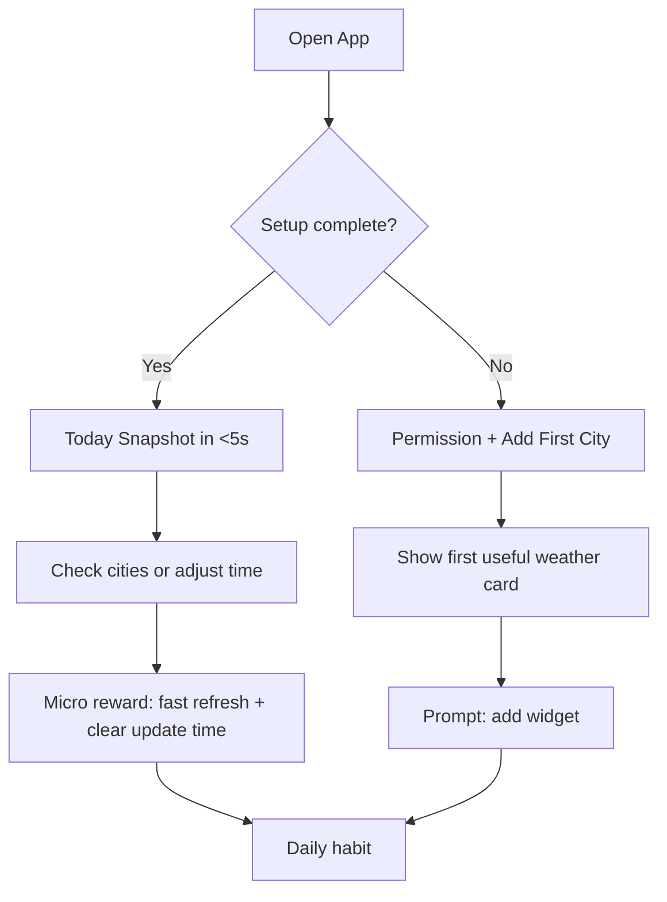
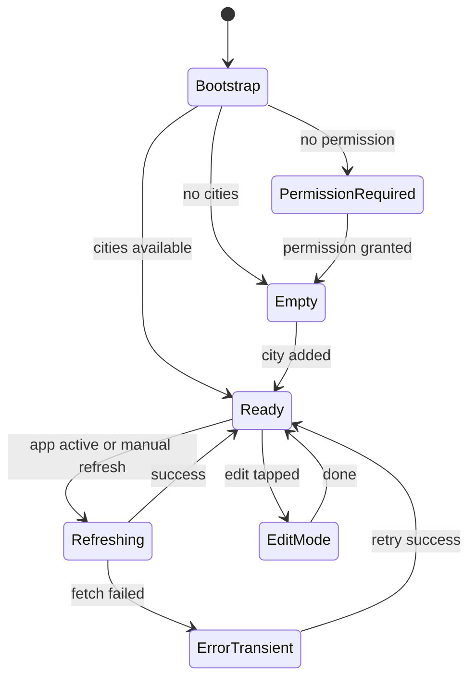

# App Redesign Retention Playbook

## 1) Purpose

Redesign the main screen so users get value in under 5 seconds, trust the widget data, and keep opening the app daily.

This playbook assumes:
- Widget behavior is already stable.
- Core weather + multi-city functionality is working.
- The next phase is retention and product polish, not technical rescue.

## 2) Product Goal

Primary goal:
- Increase repeat usage by making the home screen the fastest path to "what matters now".

Success outcomes:
- Faster first useful moment (time to first meaningful weather read).
- Higher day-1/day-7 retention.
- Higher weekly return rate from widget users.

## 3) Current Baseline (What is already strong)

From the current design + implementation:
- Strong city cards with clear temperature and local time.
- Good multi-state coverage (empty, permission, error, edit).
- Time planning and converter features are already useful.
- Repository approach for app/widget data sharing is solid.

Main friction to solve next:
- Too many high-priority blocks compete on the first screen.
- System/debug messaging can steal attention from primary value.
- Utility tools (time slider, converter) can overshadow "today summary".

## 4) Main Screen Redesign Strategy

Design principle:
- Lead with "Today" signal, then "My Cities", then utilities.

Proposed information architecture:
1. Today Snapshot (primary city + confidence state)
2. My Cities (reorderable list + add city)
3. Tools (time planner + converter, collapsible)
4. Reliability and diagnostics (moved to secondary sheet)

### Retention Loop



### Home State Model



## 5) Feature Exploration (Prioritized)

### High impact, low/medium effort (build first)

1. Home "confidence badge"
- Show one line: "Updated 2m ago" + "Widget synced".
- Reduces uncertainty and increases trust.

2. Collapsible tools section
- Keep city/weather data above the fold.
- Move time slider + converter into expandable "Tools".

3. Quick action row on Today card
- Refresh, Add City, Jump to Now.
- Removes scanning and lowers interaction cost.

4. City-level weather freshness
- Small per-city freshness dot (fresh/stale/loading/error).
- Makes async loading understandable.

### Medium impact, medium effort (next wave)

5. Time-compare mode
- Tap one city and compare local time offsets against all cards.

6. Saved city sets
- "Work", "Family", "Travel" presets.
- Fast context switching supports repeated usage.

7. Personalized routine cards
- Morning and evening summary card based on user behavior.

### Explore later (higher complexity)

8. Weather trend mini-chart per city (next 6 to 12 hours)
9. Smart travel mode (detect movement and prioritize destination city)
10. Optional severe weather alert strip

## 6) SwiftUI + Concurrency Implementation Approach

### UI architecture

Use a small, explicit screen state model:

```swift
enum HomeScreenState: Equatable {
    case bootstrap
    case permissionRequired
    case empty
    case ready
    case refreshing
    case transientError(String)
}
```

Recommended migration path:
- Keep current UI components.
- Introduce `HomeScreenState` first.
- Move modal routing to one enum (`.sheet(item:)`).
- Incrementally migrate view model to `@Observable` store.

Why this helps:
- Clear state transitions reduce UI bugs.
- Better testability for retention experiments.
- Cleaner animation and loading behavior.

### Concurrency and refresh reliability

Observed opportunity:
- Weather refresh currently spawns multiple tasks and creates new service instances per city.

Recommended approach:
- Add a `WeatherRefreshCoordinator` actor to dedupe and throttle per-city requests.
- Use structured concurrency (`withTaskGroup`) for multi-city refresh waves.
- Preserve cancellation semantics when app state changes.

Example shape:

```swift
actor WeatherRefreshCoordinator {
    private var inFlight: [UUID: Task<Double?, Never>] = [:]

    func temperature(for city: CityModel, loader: @Sendable @escaping () async -> Double?) async -> Double? {
        if let task = inFlight[city.id] { return await task.value }
        let task = Task { await loader() }
        inFlight[city.id] = task
        let value = await task.value
        inFlight[city.id] = nil
        return value
    }
}
```

## 7) Data Layer Decision (UserDefaults vs Core Data/SwiftData)

Current state is appropriate:
- `saved_cities` in app group storage is enough for city + widget sync.

Only migrate to Core Data/SwiftData when one of these is true:
- Need historical weather/events querying.
- Need conflict-aware background writes at scale.
- Need richer retention analytics beyond simple counters.

If migration happens:
- Keep widget payload in lightweight app group cache.
- Use object IDs for cross-context handoff.
- Keep UI context and background write context clearly separated.

## 8) Measurement Plan (Retention-Focused)

Track these events:
- `home_open`
- `home_ready_under_5s`
- `city_added`
- `widget_sync_status_seen`
- `tools_opened`
- `manual_refresh`
- `return_next_day`
- `return_day7`

North-star metric:
- Weekly returning users who open app on 4+ distinct days.

Supporting metrics:
- Median time to first meaningful data.
- Percentage of users with at least 2 cities saved.
- Percentage of users with widget installed and synced.

## 9) Delivery Plan (3 Iterations)

Iteration 1 (foundation)
- Add explicit home state model.
- Reorder main screen hierarchy (Today, Cities, Tools).
- Add confidence badge and quick actions.

Iteration 2 (trust and speed)
- Add refresh coordinator actor.
- Add per-city freshness indicators.
- Improve transient error copy and retry behavior.

Iteration 3 (retention growth)
- Add compare mode and city sets.
- Add event instrumentation dashboard review.
- Run A/B copy and layout tests for return rate.

## 10) Definition of Done for Redesign

A redesign release is done when:
- Users can understand current status without scrolling.
- Core actions are available in one tap from the first viewport.
- Widget trust state is explicit.
- No regression in widget sync reliability.
- Retention metrics improve over baseline for at least one full week.
